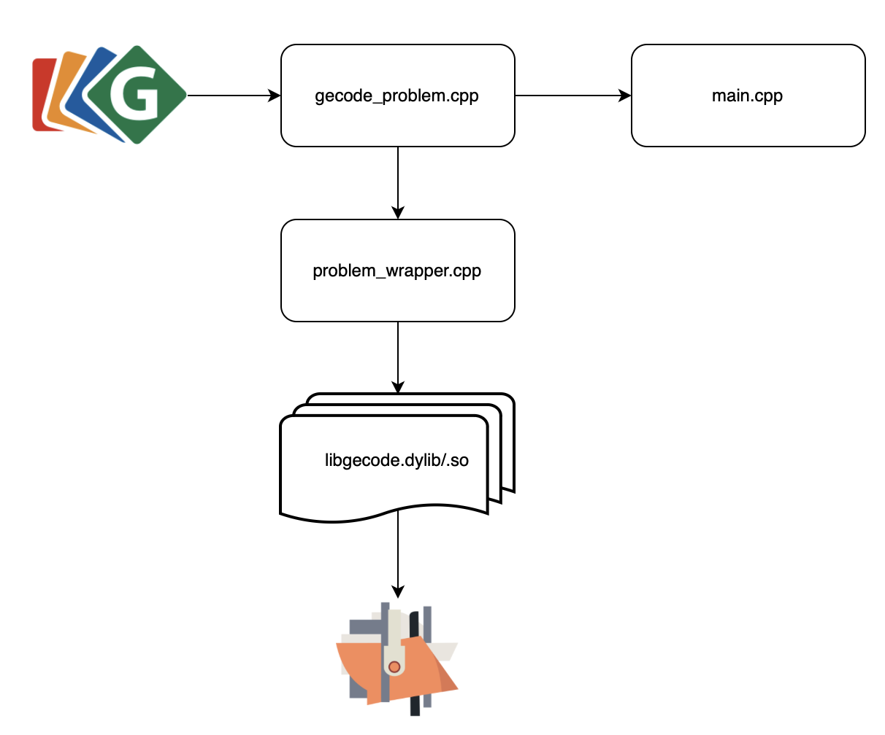

# GiL

GiL (Gecode interface Lisp) is composed of two different projects : a framework and a library. Generally, it allows to create constraint problems and to use them in Lisp, more specifically in [OpenMusic](https://openmusic-project.github.io). The framework allows to write complete [Gecode](https://www.gecode.org) problems in C++ and to integrate them in Lisp, while the library wraps Gecode functions in Lisp, allowing to write constraint problems in Lisp directly.

GiL is an open-source project, therefore any contributions are welcome. Please email me at damien.sprockeels@uclouvain.be if you wish to contribute.

## Setup
To use GiL, you need to install [Gecode](https://www.gecode.org/download.html), a Common Lisp implementation and [CFFI](https://cffi.common-lisp.dev).

## Gil Framework

The framework version of GiL can be found in the GiL_Framework folder. As its name suggests, it is a framework for integrating constraint problems into Lisp code, with the goal of calling constraint problems written with Gecode directly in Lisp. Two folders are of interest when using this framework, as well as one Lisp library file. The figure below illustrates the interactions between Gecode, the GiL framework and OpenMusic or other Common Lisp applications. 

  

### Gil_Framework.lisp
This file defines the lisp library that is necessary to use GiL in OpenMusic. It binds the dynamic library (described below) to the Lisp program, and compiles the problem-wrapper.lisp file (described below).

### c++ folder

This folder contains the Gecode aspect of the framework. It is where the constraint problem will be fully defined. A brief description of the useful files can be found below. Functions that are project-specific are marked by a @todo line in their specifications, meaning that they need to be modified for each problem you want to model (constructor,...).

***gecode_problem.cpp***
This file contains the modelization of the problem, as well as the search engine definition. For more details on how to create constraint problems using Gecode, please refer to their [website](https://www.gecode.org) where there is a complete manual. As is, GiL models a simple problem that takes as argument a size, a lower bound and an upper bound for the domain, and posts the constraint that all variables  must be different while using basic search heuristics. This example aims to ease the understanding of the framework. Currently, it only supports the creation of depth-first-search and branch-and-bound search engines, but other types can be easily added. All functions in this file write into a log.txt file by default, to ease the debugging.

***problem_wrapper.cpp***
This file wraps the functions from the gecode_problem.cpp file into a dynamic library. It is fairly straight-forward, and the in-file documentation should be more than enough to understand it.

***Utilities.cpp***
This file contains useful functions to print variables, cast vectors into pointers, etc.

***main.cpp*** 
This file calls the functions from the gecode_problem.cpp file. It can be used to test the problem in c++ before using it in Lisp.

***Makefile***
The makefile allows to compile and run the problem in command line, or to compile it into a dynamic library to be used in Lisp. The different targets are explained in the Makefile itself. A CMakeList file also exists, though I don't use CMake so it might need modifications to run. There is currently no dll target because OpenMusic on Windows does not support a 64 bit version of Lisp, making it incompatible with Gecode. However, it is fairly straightforward to compile the dynamic library for Windows as well.

### Sources folder
This folder contains the Lisp part of the GiL framework. It is intended to be used in OpenMusic, but should be useable in other Lisp programs relatively easily.

***libgecode.dylib/libgecode.so***
These files are the dynamic library that is generated from the Gecode problem developped earlier. There is no .dll version for the reasons stated before.

***problem-wrapper.lisp***
This file calls the dynamic library functions using [CFFI](https://cffi.common-lisp.dev) to make the bridge between the C functions and Lisp. Very few modifications need to be done here, but functions that should be modified are marked by a TODO line in their specifications.

Additionally,an example patch is given in OM that calls the GiL_Framework to solve the example CSP (TestProblemCreator.omp). 

## GiL Library 
The library version of GiL is a wrapper that allows to use Gecode functions in Lisp programs. It is far from complete but does provides enough tools to generate interesting CSPs in Common Lisp. It is the continuation of Baptiste Lapière's work (https://github.com/blapiere/GiL). 
Features supported include Integer, Boolean and Set variables and arrays along with a variety of constraints for those types of variables, various branching strategies, depth-first-search and branch-and-bound search engines, several search options,...

### Setup
**Disclaimer : GiL currently only works on MacOS And Ubuntu (we haven't tested it on other linux distributions).**

*For MacOS Users*
Depending on what MacOS version you are using, you might run into a problem with the dynamic library not finding Gecode due to a relative path problem. If this is the case, there is a script **script.sh** in the c++ folder that should solve the problem. You should update the value for the relative and full path in the script, then run it. The problem should be gone after that. If you have an M1 chip, you will have to recompile the dynamic library. Instructions on how to do that can be found below.

*For Linux Users*
Add the path to your gecode installation folder (it looks like gecode-release-x.x.x) to LD_LIBRARY_PATH (help [here](https://stackoverflow.com/questions/13428910/how-to-set-the-environmental-variable-ld-library-path-in-linux)). That's it.

You are ready to load the library and use it! A small example problem is shown in the **Gil** pdf. The exact same problem is given in C++ and in Lisp.

The library can only be used with [OpenMusic](https://openmusic-project.github.io/openmusic/) for now, but it shouldn't require too much effort to make it work outside of it in a Lisp environment.

### Recompiling Gil
To recompile Gil in case of problem or after some modification you can use the makefile in Gil/C++, for MacOS use "make dylib" and for linux "make so". On MacOS, make sure your Gecode library is compiled for your processor if you have an M1 chip.

### How to improve GiL
The **Gil** pdf provides explanation on how to add features to GiL. Here is a (non-exhaustive) list of ideas to add : 

- Adding the Limited Discrepancy and other search engine
- Adding support for other variable types
- Adding other constraints

Basically the long term goal is to support all Gecode features in GiL.

### Known issues
- the g-value function currently only works for displaying integer variables
- the Args variables are not supported which hurts the efficiency of the search for complex problems

